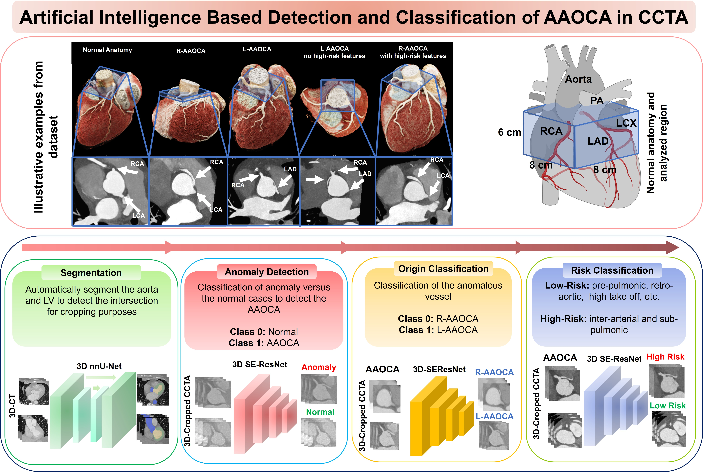

# AI based detection and classification of Anomalous Aortic Origin of Coronary Arteries in Coronary CT Angiography

## Contents

- [Overview](#overview-)
- [Project Online Page & Test](#project-online-page--test)
- [System Requirements](#system-requirements)
- [Installation Guide](#installation-guide)
- [Preprocessing](#preprocessing)
- [Train](#train)
- [Evaluate model](#evaluate-model)
- [Inference](#inference)
- [Inference On Samples](#inference-on-samples-data)
- [Explainability](#explainability)
- [Result Plots](#result-plots)
- [DockerFiles](#dockerfiles)
- [License](#license)
- [Citation](#citation)


# Overview 
Anomalous aortic origin of the coronary artery (AAOCA) is a rare cardiac condition that can cause ischemia or sudden cardiac death but might be overlooked or misclassified in routine coronary computed tomography angiography (CCTA). This fully automated, AI-based tool has been developed and externally evaluated to accurately analyze CT images to detect AAOCA, classify the origin of AAOCA, and assess anatomical risk of AAOCA.



## Project Online Page & Test
To test the developed models in this repository, you can use the online web service provided in media-blocks: </b>
[link](https://mb-neuro.medical-blocks.ch/public_access/projects)

# System Requirements
## HardWare Requirements
- Train Requirements
  - Minimum RAM of 48 GB
  - Minimum CPU of 8 Cores
  - A decent GPU with minimum of 24 GB VRAM such as Nvidia-4090, A6000, A100, etc.
- Inference Arguments
  - Minimum RAM of 8 GB
  - Minimum CPU of 4 Cores
  - For a faster inference a GPU can be used however it's not necessary.
## Software Requirements
### OS Requirements

The developed codes are tested on *Linux* operating system.
 The developmental version of the code has been tested on the following systems:

* Linux: Ubuntu 22.04, Ubuntu 24.04, Pop!_OS 22.04
* Mac OSX: Not tested
* Windows: Not tested

The codes with CUDA should be compatible with Windows, Mac, and other Linux distributions.

# Installation Guide

## Cuda Installation
To install cuda, please refer to [cuda-installation-documents](https://docs.nvidia.com/cuda/cuda-installation-guide-linux/)

## Library Installation
```commandline
pip install -r requirements.txt
```

# Preprocessing
The preprocessing consists of different stages: 
* Segmentation
* Cropping
* Resampling

The dataset structure before pre-processing has to be like the following:
```commandline
├── anomaly_detection
│   ├── train
│   │   ├── 1
│   │   │   ├── patient_id_1
│   │   │   │   ├── <img_id_1>
│   │   │   │   │   ├── img.nii.gz
│   │   │   │   ├── ...
│   │   │   │   ├── <img_id_j>
│   │   │   │   │   ├── img.nii.gz
│   │   │   ├── ...
│   │   │   ├── patient_id_n
│   │   │   │   ├── ...
│   │   ├── 0
│   ├── test_internal
│   │   ├── ...
│   ├── test_external
│   │   ├── ...
├── origin_classification
│   ├── train
│   ├── ...
├── risk_classification
│   ├── train
│   ├── ...
...
```
## Crop images based on segmentation
To only focus on the heart, we crop the input images.
### Segmentation
First download the models from [media-block](https://mb-neuro.medical-blocks.ch/shared/file/2f1cac90-ad97-11ef-b5b2-bf60ab7dd750) and unzip them to `nnunet_segmentation` directory. 
Your directory should look like the following: </br>
```commandline
├── nnunet_segmentation
│   ├── cardiac_segmentation
│   │   ├── fold_0
│   │   │   ├── checkpoint_best.pth
│   │   │   ├── checkpoint_final.pth
│   │   ├── fold_1
│   │   ├── fold_2
│   │   ├── fold_3
│   │   ├── fold_4
│   │   ├── dataset.json
│   │   ├── plans.json
│   ├── nnunet_segmentation.py
...
```
Then, segment images with the following command:
```commandline
cd nnunet_segmentation
python nnunet_segmentation.py --device cuda --input_dir ../data/anomaly_detection/train 
python nnunet_segmentation.py --device cuda --input_dir ../data/anomaly_detection/test_internal
...
python nnunet_segmentation.py --device cuda --input_dir ../data/risk_classification/test_external
```
For each image, the segmentation is saved in the image folder like the following: 
```commandline
├── anomaly_detection
│   ├── train
│   │   ├── 1
│   │   │   ├── <patient_id_1>
│   │   │   │   ├── <img_id_1>
│   │   │   │   │   ├── img.nii.gz
│   │   │   │   │   ├── seg.nii.gz
│   │   │   │   ├── ...
│   │   │   │   ├── <img_id_j>
│   │   │   │   │   ├── img.nii.gz
│   │   │   │   │   ├── seg.nii.gz
│   │   │   ├── ...
│   │   │   ├── <patient_id_n>
│   │   │   │   ├── ...
│   │   ├── 0
│   ├── test_internal
│   │   ├── ...
│   ├── test_external
│   │   ├── ...
```
### Crop
Crop images using the segmentations previously created using the following commands:
```commandline
# cd to the project's root page
python preprocessing_cropping.py --input_dir data/anomaly_detection/train 
python preprocessing_cropping.py --input_dir data/anomaly_detection/test_internal
... 
python preprocessing_cropping.py --input_dir data/risk_classification/test_external
```
The cropped images are saved in the original image folder like the following:
```commandline
├── anomaly_detection
│   ├── train
│   │   ├── 1
│   │   │   ├── <patient_id_1
│   │   │   │   ├── <img_id_1>
│   │   │   │   │   ├── img.nii.gz
│   │   │   │   │   ├── seg.nii.gz
│   │   │   │   │   ├── img_cropped.nii.gz
│   │   │   │   │   ├── seg_cropped.nii.gz
│   │   │   │   ├── ...
│   │   │   │   ├── <img_id_j>
│   │   │   │   │   ├── img.nii.gz
│   │   │   │   │   ├── seg.nii.gz
│   │   │   │   │   ├── img_cropped.nii.gz
│   │   │   │   │   ├── seg_cropped.nii.gz
│   │   │   ├── ...
│   │   │   ├── <patient_id_n>
│   │   │   │   ├── ...
│   │   ├── 0
│   ├── test_internal
│   │   ├── ...
│   ├── test_external
│   │   ├── ...
```

### Resample images
To resample the cropped images and saving it into a numpy file use the following command:
```commandline
python preprocessing_resampling.py --dataset_path data/anomaly_detection/train  --output_path numpy_datasets/anomaly_detection/train
python preprocessing_resampling.py --dataset_path data/anomaly_detection/test_internal  --output_path numpy_datasets/anomaly_detection/test_internal
...
python preprocessing_resampling.py --dataset_path data/risk_classification/test_external  --output_path numpy_datasets/risk_classification/test_external
```
The resampled images are saved in the original folder like the following:
```commandline
├── anomaly_detection
│   ├── train
│   │   ├── 1
│   │   │   ├── <patient_id>
│   │   │   │   ├── <img_id_1>
│   │   │   │   │   ├── <img_id_1>.nii.gz
│   │   │   │   │   ├── img.nii.gz
│   │   │   │   │   ├── seg.nii.gz
│   │   │   │   │   ├── seg_cropped.nii.gz
│   │   │   │   │   ├── img_cropped.nii.gz
│   │   │   │   │   ├── img_cropped_resampled.nii.gz
│   │   │   │   ├── ...
│   │   ├── 0
│   ├── test_internal
│   │   ├── ...
│   ├── test_external
│   │   ├── ...
```
**Note**: This may take some minutes based on your dataset size and number of CPU cores!

# Train
Once the images are pre-processed and the .npz arrays are saved, a model can be trained and tested with the following command:
```commandline
python train.py --train_on numpy_datasets/anomaly_detection/train.npz --test_on numpy_datasets/anomaly_detection/test_internal.npz --output_path results/anomaly_detection/train/model_1 
```
where in this example we train a model for the anomaly detection task and evaluate it on the internal test set.

**Note**: For more information execute `python train.py --help`.
## Train Output
After training your result directory would be like the following:
```commandline
├── anomaly_detection
│   ├── train
│   │   ├── model_1
│   │   │   ├── config.json
│   │   │   ├── best_val_model.pt # best model on validation
│   │   │   ├── last_val_model.pt # last model 
│   │   │   ├── loss_epochs.png
│   │   │   ├── last_optimizer.pt # the state of the optimizer at the end of the training
│   │   │   ├── last_scheduler.pt # the state of the scheduler at the end of the training
│   │   │   ├── metrics_best.pt # mertics evaluated on the input test datasets using best_val_model.pt
│   │   │   ├── metrics_last.pt # mertics evaluated on the input test datasets using last_best_model.pt
│   │   │   ├── val_losses.npy
│   │   │   ├── train_losses.npy
│   │   │   ├── test_internal_predictions_best.csv # prediction for the tested dataset with best_val_model.pt
│   │   │   ├── test_internal_predictions_val.csv # prediction for the tested dataset with last_val_model.pt
│   │   ├── model_2
│   │   ├── ...   
```
**Note**: Training a model for the other tasks, namely risk and origin classifications, follows the same steps. 
# Evaluate model
To evaluate a trained model on a given labeled dataset use the `evaluation.py` script. The command would be, for example:
```commandline
python evaluation.py --model_path results/anomaly_detection/train/model_1/best_val_model.pt --dataset_path numpy_datasets/anomaly_detection/test_external.npz --output_path results/anomaly_detection/train/model_1/test_external
```
In case you want to do ensemble, you can pass more than one `model_path`:
```commandline
python evaluation.py --model_path results/anomaly_detection/train/model_1/best_val_model.pt results/anomaly_detection/train/model_2/best_val_model.pt --dataset_path numpy_datasets/anomaly_detection/test_external.npz --output_path results/anomaly_detection/train/test_external
```

# Explainability
To understand which part of an image was the most important for the model to make the prediction, a GradCAM++ heatmap can be created.
Given a trained model, the GradCAM++ heatmap for an input CT image which is cropped and converted to .nii.gz format can be obtained with the following command:

**Note:** The input image must be cropped before passing it to the model.
```commandline
python explainability.py --model_path results/anomaly_detection/train/model_1/best_val_model.pt --image_path <IMG_PATH.nii.gz> --output_path gradcams/heatmap.nii.gz 
```

| Normal                                                         | R-AAOCA Low Anatomical Risk             | R-AAOCA High Anatomical Risk                                       |
|----------------------------------------------------------------|-----------------------------------------|--------------------------------------------------------------------|
|  |   |  |

| L-AAOCA Low Anatomical Risk                                       | L-AAOCA Low Anatomical Risk                                        | L-AAOCA High Anatomical Risk                                       |
|-------------------------------------------------------------------|--------------------------------------------------------------------|--------------------------------------------------------------------|
|  |  |  | 
# Result Plots

## TSNE 
To better appreciate the power of the trained models, we provide the code to map them in 2d views. </br> 
First features for all the input cropped samples should be created using the following command: 
```commandline
python extract_latent_features.py --model_path results/anomaly_detection/train/model_4/best_val_model.pt --dataset_path numpy_datasets/anomaly_detection/train.npz numpy_datasets/anomaly_detection/test_internal.npz numpy_datasets/anomaly_detection/test_external.npz --output_path latent_features 
```
Then create tsne projections from the latent features using the following command:
```commandline
python tsne_projections.py --latent_features_path latent_features
```

Then use the `paper_plot_table_results.ipynb` notebook to generate the graphs. See the notebook for more information.

**Note**: Result graphs will be provided after publication!

## Performance 
The code for generating plots is available in `evaluation_core.py`. 
This script gathers predictions from all trained models, computes metrics, and creates plots for both individual and ensemble models.
It generates plots for the entire test datasets as well as stratified results by gender, covering all models, tasks, and training strategies.
All figures and tables that are present in the paper are generated with the `paper_plot_table_results.ipynb` notebook.

# Inference
Since all tasks use the same deep learning architecture (SEResNet-3D), the inference code is identical for all of them. The task can be switched simply by specifying the model path, with no need to manually specify it.
Moreover, users can enable ensembling by providing multiple models.
1. If the input nifti files are not cropped follow the following command: 
```commandline
python inference.py --model_path results/anomaly_detection/train/model_1/best_val_model.pt results/anomaly_detection/train/model_4/best_val_model.pt --sample_path <path to nifti file>.nii.gz 
python inference.py --model_path results/anomaly_detection/train/model_1/best_val_model.pt results/anomaly_detection/train/model_4/best_val_model.pt --sample_path <path to dir with nifti files> 
```
2.If the input nifti files are cropped: 
```commandline
python inference.py --model_path results/anomaly_detection/train/model_1/best_val_model.pt results/anomaly_detection/train/model_4/best_val_model.pt --sample_path <path to nifti file>.nii.gz --is_cropped 
python inference.py --model_path results/anomaly_detection/train/model_1/best_val_model.pt results/anomaly_detection/train/model_4/best_val_model.pt --sample_path <path to dir with nifti files> --is_cropped 
```
Finally, you can get the csv files containing the predictions in the `output` directory! 

Note: Run `python inference.py --help` for more options!

# Inference on samples data
Download online samples from [media-blocks](https://mb-neuro.medical-blocks.ch/shared/folder/67a394b0-ae38-11ef-89f5-5137b14d4312).
To run inference, no special architecture is required. The code will be applied to all the `.nii.gz` samples in sample_path directory, however, to get the same exact result, here is the file architecture:

```commandline
├── samples
│   ├── narco
│   │   ├── 11943667
│   │   │   ├── img.nii.gz
│   │   ├── 12017913
│   │   │   ├── img.nii.gz
│   │   ├── 12065293
│   │   │   ├── img.nii.gz
│   │   ├── 12076929
│   │   │   ├── img.nii.gz
│   ├── normal
│   │   ├── 10064059
│   │   │   ├── img.nii.gz   
```

Then run the following code for anomaly detection:
```commandline
python inference.py --model_path results/anomaly_detection/strategy3/model_1/best_val_model.pt results/anomaly_detection/strategy3/model_2/best_val_model.pt results/anomaly_detection/strategy3/model_3/best_val_model.pt results/anomaly_detection/strategy3/model_4/best_val_model.pt results/anomaly_detection/strategy3/model_5/best_val_model.pt --sample_path samples --output samples_output
```
Expected output is in `samples_output/mean_prediction.csv`

**Note:** 
- Rounded up to 3 places.
- Due to differences in docker and cuda versions, you may get very slightly different outputs on the web-application, which does not affect the final results. 

img_path | prediction | cut-off label | true label |
---|------------|---------------|---------------|
samples/normal/10064059/img.nii.gz | 0.000      | 0             | 0             
samples/narco/12076929/img.nii.gz  | 0.824      | 1             | 1            
samples/narco/12017913/img.nii.gz  | 1.000      | 1             | 1          
samples/narco/11943667/img.nii.gz  | 0.594      | 1             | 1        
samples/narco/12065293/img.nii.gz  | 1.000      | 1             | 1      

Then run the following code for risk classification:
```commandline
python inference.py --model_path results/risk_classification/train/model_1/best_val_model.pt results/risk_classification/train/model_2/best_val_model.pt results/risk_classification/train/model_3/best_val_model.pt results/risk_classification/train/model_4/best_val_model.pt results/risk_classification/train/model_5/best_val_model.pt --sample_path samples/narco --output samples_output/risk
```
Expected output is in `samples_output/risk/mean_prediction.csv`

img_path | prediction | cut-off label |true label |
---|------------|---------------|---------------|
samples/narco/12076929/img.nii.gz | 0.000      | 0  | 0             
samples/narco/12017913/img.nii.gz | 1.000      | 1  | 1           
samples/narco/11943667/img.nii.gz | 0.000      | 0 | 0            
samples/narco/12065293/img.nii.gz | 1.000      | 1 | 1             


Then run the following code for risk classification:
```commandline
python inference.py --model_path results/origin_classification/train/model_1/best_val_model.pt results/origin_classification/train/model_2/best_val_model.pt results/origin_classification/train/model_3/best_val_model.pt results/origin_classification/train/model_4/best_val_model.pt results/origin_classification/train/model_5/best_val_model.pt --sample_path samples/narco --output samples_output/origin
```
Expected output is in `samples_output/origin/mean_prediction.csv`

img_path | prediction | cut-off label | true label |
---|------------|---------------|---------------|
samples/narco/12076929/img.nii.gz | 1.000      | 1    | 1         
samples/narco/12017913/img.nii.gz | 0.005      | 0  | 0           
samples/narco/11943667/img.nii.gz | 0.008      | 0   | 0          
samples/narco/12065293/img.nii.gz | 0.001      | 0    | 0         


*Note*: One can also download data [A-Large-Scale-Dataset-and-Benchmark-for-Coronary-Artery-Segmentation-based-on-CT](https://www.kaggle.com/datasets/xiaoweixumedicalai/imagecas) which includes 1000 samples and apply the models to them. 

## Inference Time:
To have the inference time add `--timeit` to inference code.

Notes: 
1. whole time includes loading models, cropping, and model inferences.
2. CPU: Core-i9
3. GPU: Nvidia 4090
4. All the times are on one sample
5. The numbers are in seconds
6. The segmentation inference depends on the input image size. The tests are for `samples/narco/11943667/img.nii.gz`.

records | cropped      | seg n-folds | n-cls-models | device | whole time | classification time | segmentation time | cropping time |
---|--------------|-------------|--------------|--------|------------|---------------------|-------------------|--------|
0 | yes          | -           | 1            | cpu    | 2.38       | 1.01                | -                 | -| 
1 | yes          | -           | 5            | cpu    | 10.14      | 4.57                | -                 |-| 
2 | yes          | -           | 1 | cuda   | 1.68       | 0.14                | -                 | -|            
3 | yes          | -           | 5            | cuda   | 6.70       | 0.28                | -                 |-|
2 | No           | 5           | 5 | cuda   | 27.35      | 1.09                | 12.73             | 6.56
2 | No           | 1           | 5 | cuda   | 24.18      | 1.07                | 9.80              | 6.57
2 | No           | 5           | 5 | cpu    | 240.02     | 4.68                | 223               | 6.20
2 | No           | 1           | 5 | cpu    | 72.25      | 5.16                | 54.72             | 6.25


# DockerFiles:
For docker files and inference please check [docker_project](docker_project/README.md) directory.

# License
This project is covered under the [Attribution-NonCommercial 4.0 International](LICENSE.md) License.

# Citation
Please kindly cite the following paper if you use this repository.

```
@article{Shiri2024,
  author = {Shiri, I., Baj, G., Mohammadi Kazaj, P., Bigler, M. R., Stark, A. W., Valenzuela, W., Kakizaki, R., Siepe, M., Windecker, S., Räber, L., Giannopoulos, A. A., Siontis, G. C. M., Buechel, R. R., & Gräni, C.},
  title = {AI Based Anomalous Aortic Origin of Coronary Arteries Detection and Classification in Coronary CT Angiography},
  journal = {},
  year = {2024},
  note = {In submission},
  doi = {},
  pmid = {}
}

```
Shiri, I., Baj, G., Mohammadi Kazaj, P., Bigler, M. R., Stark, A. W., Valenzuela, W., Kakizaki, R., Siepe, M., Windecker, S., Räber, L., Giannopoulos, A. A., Siontis, G. C. M., Buechel, R. R., & Gräni, C. (2024). AI Based Anomalous Aortic Origin of Coronary Arteries Detection and Classification in Coronary CT Angiography. In submission.


```
This tool is intended for research purposes only and has not been approved for clinical use.
```
